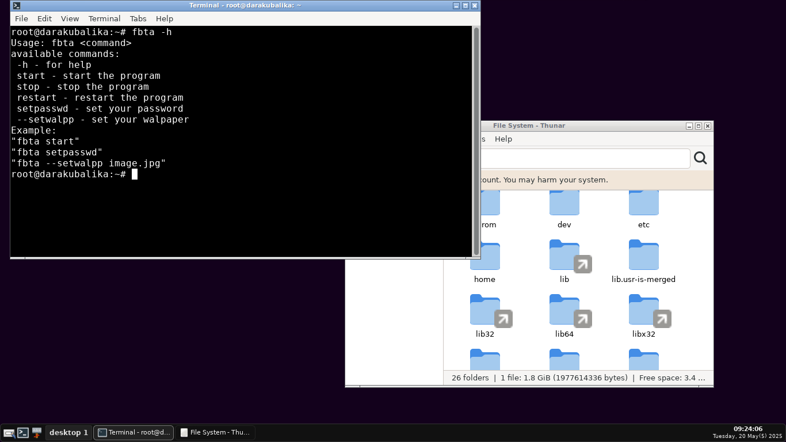
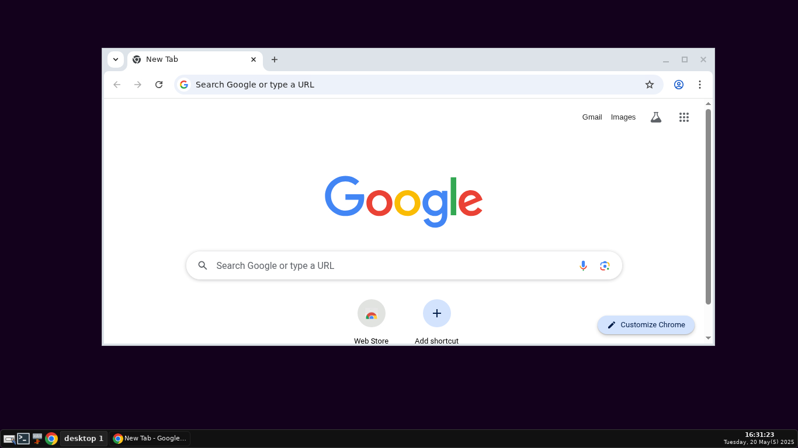

<h1 align='center'>Welcome</h1>

<div align="center">
<!--  --->
<p align="center">
 
 <a href="https://github.com/darakubalika/fbtagui/blob/master/LICENSE"></a>
 </p>
 
<p align="center">
Hi.

v1.0.0
<br/>
</p>
</div>


## Setup fbtagui
Needed
-   [x] Only supports Ubuntu and Debian
-   [x] Minimum Ubuntu20.04 and Debian10 versions below are not recommended
-   [x] Requires root access
-   [x] Requires stable internet access

1. Download file setup fbtagui<br />

```bash
wget https://raw.githubusercontent.com/darakubalika/fbtagui/master/setup
```
or
```bash
curl -O https://raw.githubusercontent.com/darakubalika/fbtagui/master/setup
```
2. Give execute permission to the file<br />
```bash
chmod +x setup
```
3. run
```bash
./setup
```
you can start the setup

## SHA256sum
```bash
4cdbed54e8e83ab4ca363bdb5190a97987b944413ea0ca59a5f41640a6a7f9bf
```
## Important
When the setup process is taking place, it is not recommended to stop the setup process forcibly because it can cause errors in your system. The solution if you experience being stuck in the checking or loading process for several hours even though your connection is secure, you can reboot your system and do the setup process again.

If the program is running, you can directly access it via a client that has a browser such as a phone or PC. You can log in using the URL from your server/VPS, for example http://103.23.87.11:8910 or if you link it using a domain, you can use http://yourdomainname.com:8910

If you encounter an error and cannot continue the setup and you also cannot reboot, you can use this command when that happens.
```bash
kill $(pgrep apt) ; dpkg --configure -a
```
## Install browser
Here I give an example using the Chrome browser
1. Download Chrome using this official link. If the link is not working, you can check it directly on the [Google Chrome](https://google.com/chrome/?platform=linux) website
```bash
wget https://dl.google.com/linux/direct/google-chrome-stable_current_amd64.deb
```
or
```bash
curl -O https://dl.google.com/linux/direct/google-chrome-stable_current_amd64.deb
```
2. Install chrome
```bash
apt install ./google-chrome-stable_current_amd64.deb -y
```
3. Add chrome in the panel
4. Edit the Google Chrome launcher so that it can be used.
```bash
vi /usr/share/applications/google-chrome.desktop
```
or
```bash
nano /usr/share/applications/google-chrome.desktop
```
find the ```Exec=/usr/bin/google-chrome-stable %U``` section and add ```--no-sandbox``` like this ```Exec=/usr/bin/google-chrome-stable %U --no-sandbox```, If you have, you can save it and then Chrome can be run from the launcher.
## Command
```bash
Usage: fbta <command>
available commands:
 -h - for help
 start - start the program
 stop - stop the program
 restart - restart the program
 setpasswd - set your password
 --setwalpp - set your walpaper
Example:
"fbta start"
"fbta setpasswd"
"fbta --setwalpp image.jpg"
```

## Screenshots

<p align="center">
  
</p>

<p align="center">
  
</p>
